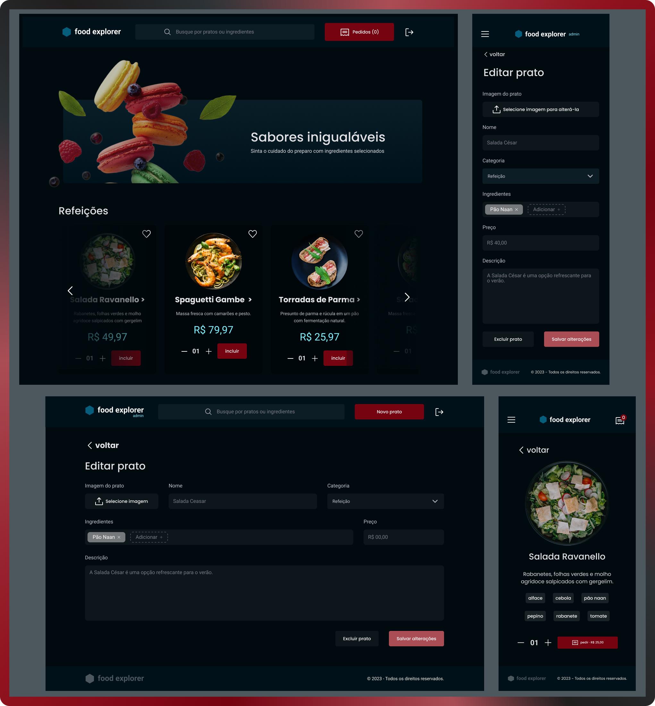

<!--Banner session-->
<p>
  
  
</p>

<br><br>

<!--About session-->
<h1 align="center"> Food Explorer - Frontend</h1>

<p align="center">
  <a href="#Project">Project</a>&nbsp;&nbsp;&nbsp;|&nbsp;&nbsp;&nbsp;
  <a href="#Deploy">Deploy</a>&nbsp;&nbsp;&nbsp;|&nbsp;&nbsp;&nbsp;
  <a href="#Technologies">Technologies</a>&nbsp;&nbsp;&nbsp;|&nbsp;&nbsp;&nbsp;
  <a href="#Structure">Structure</a>&nbsp;&nbsp;&nbsp;|&nbsp;&nbsp;&nbsp;
  <a href="#Pages">Pages</a>&nbsp;&nbsp;&nbsp;|&nbsp;&nbsp;&nbsp;
  <a href="#Features">Features</a>&nbsp;&nbsp;&nbsp;|&nbsp;&nbsp;&nbsp;
  <a href="#Usage">Usage</a>&nbsp;&nbsp;&nbsp;|&nbsp;&nbsp;&nbsp;
  <a href="#Learnings">Learnings</a>&nbsp;&nbsp;&nbsp;|&nbsp;&nbsp;&nbsp;
  <a href="#Install">Install</a>&nbsp;&nbsp;&nbsp;|&nbsp;&nbsp;&nbsp;
  <a href="#Contacts">Contacts</a>&nbsp;&nbsp;&nbsp;|&nbsp;&nbsp;&nbsp;
  <a href="#License">License</a>&nbsp;&nbsp;&nbsp;
</p>

<div align="center">
  
</div>


<br>

<h3 id="Project"> 🏆 Project </h3>

  Front-end of the Food Explorer project, final challenge of the fullstack Explorer by [Rockeseat](https://www.rocketseat.com.br/).

  **Food Explorer is a ReactJS food ordering application** built on top of [this Figma layout](https://www.figma.com/community/file/1196874589259687769). It calls the API using Axios, with the JWT token sent in the `Authorization` header.

  The admin user can create, view, edit and delete dishes, create and delete ingredients.
  Regular users can see all registered dishes and access a screen with detailed information about the dish clicked.
  Both can search by dish name or ingredient.

  The back-end repository is available here [here](http://github.com/MichelleCordeiro/food-explorer-api).

<br>

<h3 id="Deploy"> 🌐 Deploy </h3>

This front-end is hosted on [Netlify]() and can be accessed [here]().

To generate the authentication token on the sessions route:
- register as a regular user, or
- log in as admin using the credentials below:


```
  Admin:
    login: admin@email.com
    password: 123
```

> ⚠️ Since this service is hosted on a free plan, the application will 'sleep' after 15 minutes of inactivity. If the API is unresponsive, please wait a moment while it initializes.

<br>

<h3 id="Technologies"> 🚀 Technologies </h3>

This project was developed using the following technologies and tools:
<table>
  <tr>
    <td>

  - <code> HTML</code>
  - <code> CSS</code>
  - <code>ViteJS</code>
  - <code> ReactJS</code>
  - <code></code>
  - <code> Swiper</code>

    </td>
    <td>

      - <code></code>
      - react-router-dom (useNavigate, useLocation, useParams, Link )
      - react hooks (useState, useEffect, useMemo, useRef)
      - context: global state (createContext, useContext)
      - react-icons
      - styled-components
      - localStorage
      - API service
    </td>
  </tr>
</table>

<br>

<h3 id="Structure"> 📂 Structure </h3>

- `/src/components` - reusable components
- `/src/pages` - application pages
- `/src/routes` - route configuration
- `/src/styles` - global styles and themes
- `/src/assets` - assets (images, icons, etc.)
- `/src/hooks` - custom hooks (auth.jsx and useDishForm.js)
- `/src/context` - react contexts for global state management (SearchContext.jsx)
- `/src/services` - services for API communication
- `/src/utils` - utility functions (utils.js and validateDish.js)

<br>

<h3 id="Pages"> 📖 Pages </h3>
<table>
  <tr>
    <th>
      Ready
    </th>
    <th>
      🚧 In development
    </th>
  <tr>
    <td>
      <li>Register</li>
      <li>Login</li>
      <li>Home</li>
      <li>Dish details</li>
      <li>New dish</li>
      <li>Edit dish</li>
    </td>
    <td>
      <li>User Profile</li>
      <li>Favorites</li>
      <li>Cart</li>
      <li>Order History</li>
    </td>
  </tr>
</table>

<br>

<h3 id="Features"> 🎯 Features </h3>

 - Login
 - Logout
 - Register
 - Add, edit and delete dishes (admin users only)
 - Add and delete ingredients (admin users only)
 - Show all dishes per category
 - Show dish details
 - Search by dish and ingredient

<br>

<details id="Usage">
<summary>💡 Usage (click to expand)</summary>

1. Register a new user or login with admin credentials.
2. Browse dishes by category or search by name/ingredient.
3. Add dishes to favorites or cart (when implemented).
4. Admin users can add, edit, or delete dishes and ingredients.
5. Place orders and track order history (when available).

</details>

<br>

<h3 id="Learnings"> 📚 Learnings </h3>

<table>
  <tr>
    <td>
      <li>vite</li>
      <li>ES6 modules</li>
      <li>theme and global style</li>
      <li>styled components</li>
      <li>react components</li>
      <li>react hooks</li>
      <li>react icons</li>
      <li>responsive design</li>
      <li>map and filter</li>
    </td>
    <td>
      <li>promises with async/await</li>
      <li>error handling - try...catch</li>
      <li>react routes</li>
      <li>react contexts for global state</li>
      <li>react router dom for navigation</li>
      <li>user authentication</li>
      <li>axios for call the API</li>
      <li>callback functions</li>
      <li>swiper for carousel/slider</li>
    </td>
  </tr>
</table>


<br>

<!-- Execution session -->
<h3 id="Install"> ⚡ Install and configure</h3>

&emsp; You need [Node.js](https://nodejs.org/en/) and [npm](https://www.npmjs.com/) installed to run this application.


&emsp; 1. Clone or download the repository and access the project folder

```bash
  git clone https://github.com/MichelleCordeiro/food-explorer-api

  cd food-explorer
```

&emsp; 2. Install the project dependencies

```bash
  npm install
```

&emsp; 3. Run the application's frontend
```bash
  npm run dev
```

 > ⚠️ For the application to work, both the back-end API and the front-end must be running. You can find the back-end in the [food-explorer-api](https://github.com/MichelleCordeiro/food-explorer-api) repository.

 &emsp; 4. Open http://localhost:5173 in your browser to access the application.

<br>

<!-- Contacts session -->
<h3 id="Contacts"> 👩🏼‍💻 Contacts </h3>

<p>
  <strong>&emsp; Michelle Cordeiro</strong> &emsp;
  <a href="https://www.linkedin.com/in/michelle-cordeiro/">
     LinkedIn
  </a> &emsp;
  <a href="michelle8cordeiro@gmail.com">
    
    E-mail: michelle8cordeiro@gmail.com
  </a>
</p>

<br>

<!-- Licences session -->
<h3 id="License"> 📝 License </h3>

This project is licensed under the MIT License.


<a href="LICENSE"></a>

<br>

---

Made with 💜 by [Michelle Cordeiro](https://www.linkedin.com/in/michelle-cordeiro/)

---
